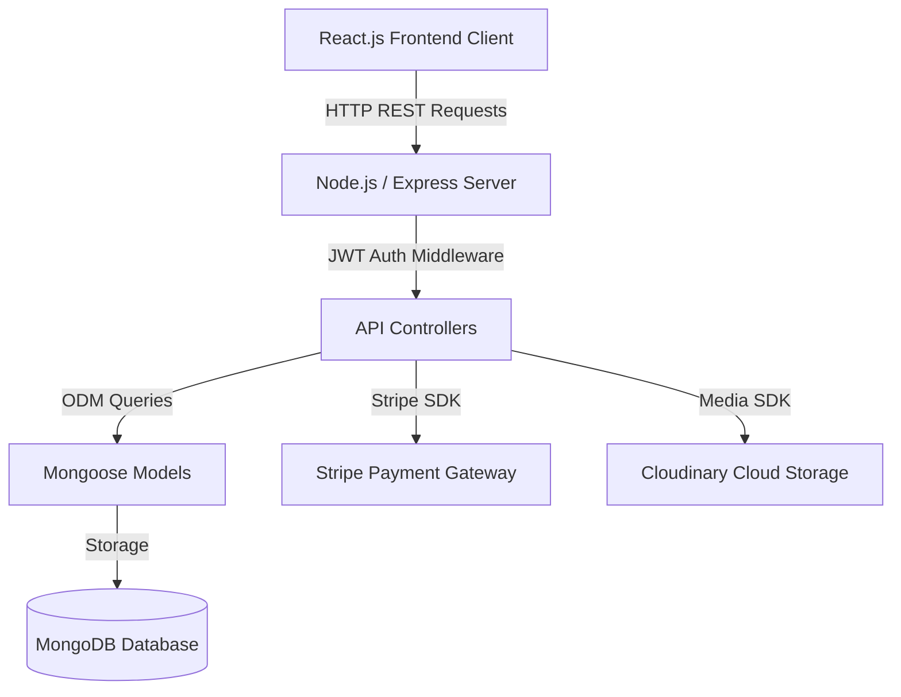

# 🎨 Artisan's Corner - Multi-Vendor Marketplace for Handmade Goods

[](https://opensource.org/licenses/MIT)
[](https://nodejs.org/)
[](https://reactjs.org/)
[](https://www.mongodb.com/)

**Artisan's Corner** is an enterprise-grade, multi-vendor e-commerce marketplace built using the **MERN Stack** (MongoDB, Express.js, React, Node.js). The platform enables independent craftsmen and local artisans to create branded stores, list handcrafted products, and sell globally.

---

## 🌟 Key Features

### 👤 Role-Based Authorization
- **Buyer**: Browse catalog, search/filter products, manage cart, checkout with Stripe simulation, track orders, and leave verified reviews.
- **Seller (Vendor)**: Onboard by creating a Store profile, list and manage products, track store analytics, and process buyer orders.
- **Admin**: Platform oversight, monitor GMV and platform commission, moderate vendor stores, and manage user accounts.

### 💰 Commission & Financial Model
- **Platform Commission**: 5% on every completed product sale.
- **Seller Earnings**: 95% of gross sales automatically calculated and recorded.
- *(Note: Financial metrics are calculated and stored; real bank wire transfers are simulated for safety).*

### 🚚 Order Delivery Lifecycle
Every order moves through a strict status workflow:
`Pending` ➔ `Paid` ➔ `Processing` ➔ `Packed` ➔ `Shipped` ➔ `Delivered` *(Optional: `Cancelled`, `Refunded`)*.

---

## 🏗️ Architecture Overview



---

## 🛠️ Technology Stack

- **Frontend**: React 18, React Router DOM v6, Tailwind CSS, Axios.
- **Backend**: Node.js, Express.js, JWT Authentication, Bcrypt.js, Helmet, Morgan, CORS.
- **Database**: MongoDB & Mongoose ODM.
- **Payment & Cloud**: Stripe API (Test Mode), Cloudinary.

---

## 🔑 Demo Credentials (Auto-Fill Available on Login Page)

| Role | Email | Password |
| :--- | :--- | :--- |
| **Buyer** | `buyer@example.com` | `password123` |
| **Seller** | `seller@example.com` | `password123` |
| **Admin** | `admin@example.com` | `password123` |

---

## 🚀 Quick Start & Installation Guide

### Prerequisites
- Node.js (v16.0 or higher)
- npm or yarn

### 1. Clone the repository
```bash
git clone https://github.com/your-username/artisans-corner.git
cd artisans-corner
```

### 2. Install Backend & Frontend Dependencies
```bash
# Install root & backend dependencies
npm install

# Install client dependencies
cd client
npm install
cd ..
```

### 3. Environment Configuration
Create a `.env` file inside the `server/` directory:
```env
PORT=5000
NODE_ENV=development
MONGO_URI=mongodb://127.0.0.1:27017/artisans_corner
JWT_SECRET=supersecretkey_artisans_corner_2026
JWT_EXPIRES_IN=30d
```

### 4. Run Locally
To run both backend API server and frontend client concurrently:
```bash
npm run dev
```
- **Frontend App**: http://localhost:3000
- **Backend API**: http://localhost:5000/api
- **Health Check**: http://localhost:5000/health

---

## 📄 License
Distributed under the MIT License. See `LICENSE` for details.